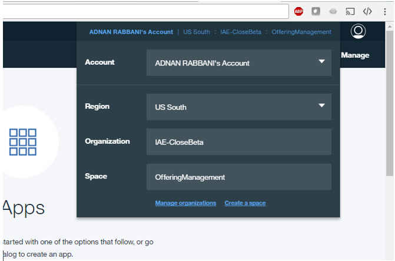

# Scenario: Exploring heating complaints in Manhattan using IBM Analytics Engine
IBM Analytics Engine provides a flexible framework to develop and deploy analytics applications in Apache Hadoop and Apache Spark. IBM Analytics Engine allows you to create and manage clusters by using the Bluemix interface, or by using the Cloud Foundry CLI and REST APIs.

The two following scenarios demonstrate tasks to show how to query data using Spark SQL through a notebook in Data Science Experience (DSX) and how to run a Spark application by using Spark submit.

An open data set from the City of New York containing calls to the 311 number to report issues with infrastructure is provided.


## Prerequisites
1. In the WDP Beta Welcome email, you were provided with: 

	* an IBM ID that has been set up specifically to access WDP Beta
	* IBM Cloud Object Storage (COS) access ID and key for storing data assets
	
	Both IDs are required to run this scenario. 
	
1. Download and expand the compressed data file for these scenarios (`IAE_example_311NYC.csv`):

	* [`IAE_example_311NYC.zip`](https://github.com/wdp-beta/get-started/blob/master/data/IAE_examples_data_311NYC.zip)

1. For general overview and getting-started information, you can access the DSX documentation at: 
<https://datascience.ibm.com/docs/content/getting-started/welcome-main.html>.


Before starting these tasks, create an IBM Analytics Engine cluster and upload data to object storage. The scenario tasks are run on a Spark and Hadoop cluster created with IBM Analytics Engine.

### Create an IBM Analytics Engine cluster

1. Log in to [Bluemix](http://www.bluemix.net).

2. Click the account management widget and choose the organization **IAE-CloseBeta** as shown in the following image.


3. Select the **Space** that was assigned to you in your welcome email.

4. Navigate to the [IBM Analytics Engine catalog page](https://console.bluemix.net/catalog/services/ibm-analytics-engine?env_id=ibm:yp:us-south&taxonomyNavigation=apps) to create the cluster. <!-- where is it??? --> Learn how to create and use the IBM Analytics Engine service in the [IBM Analytics Engine documentation](https://console.bluemix.net/docs/services/AnalyticsEngine/index.html#introduction).

### Uploading data
IBM Analytics Engine is based on Apache Hadoop and Spark. While it provides the HDFS file system and a limited amount of storage in the cluster, we recommend using IBM Cloud Object Store or the Swift-based Bluemix Object Storage service to store data.

Jobs from an Analytics Engine compute cluster can be run against data in object stores, and results of jobs can be written back to the object store. IBM Analytics Engine also enables you to integrate the storage service with the Watson Data Platform protected access layer, providing access control to your data.

To upload data into the object store, refer to documentation of the respective offerings: [IBM Cloud Object Store](https://ibm-public-cos.github.io/crs-docs/) / [Bluemix Object Storage service](https://console.bluemix.net/docs/services/ObjectStorage/index.html).

## Scenarios

### Querying data using Spark SQL through a DSX notebook
**Spark SQL** is a **Spark** module for structured data processing. Unlike the basic **Spark** RDD API, the interfaces provided by Spark SQL provide **Spark** with more information about the structure of both the data and the computation being performed. You can interact with **Spark** SQL using SQL and the Dataset API.

For this task, use the NYC311 data set that you previously uploaded to your object store. You wil use DSX Jupyter notebooks to run applications on your IBM Analytics Engine cluster. Before you can start sending queries and jobs using DSX notebooks to the Spark instance in the IBM Analytics Engine service, establish a connection between them.

You can create multiple projects in DSX, and each project can have multiple associated services. A provisioned IBM Analytics Engine instance needs to be configured as an associated service with the project that you plan to use to access this IBM Analytics Engine instance.

In addition, a project must be created for you to associate and use IBM Analytics Engine with. When creating a new project you select a Spark service. Select any available Spark service; IBM Analytics Engine can only be associated after the project is created.

**To connect your DSX instance to IBM Analytics Engine cluster**

1. [Sign in to Data Science Experience](https://datascience.ibm.com/).

2. Open the DSX project that you want to use with IBM Analytics Engine.

3. Select the project **Settings** tab and scroll down to see the **Associated Services** list.

4. Click **add associated service**. A menu of services is displayed.

5. Select **Amazon EMR Spark**.  

6. Enter a name to identify your IBM Analytics Engine Spark service.

7. For the **Personal Access Token**, enter `wceadmin:<userid>:<password>`. The `<userid>` and `<password>` are your cluster user and password credentials. To access the credentials, go to **Service** in Bluemix and click the **Credentials** tab.
 **Note**: The "wceadmin:" is an internal identifier that's used by DSX.

8. For the **Kernel Gateway URL**, enter the notebook_gateway URL present in your cluster VCAP of IBM Analytics Engine. To access the URL, go to **Service** in Bluemix and click the **Credentials** tab.

11. Click **Save**.

When you create a new notebook in this project, select the new IBM Analytics Engine Spark service to run the notebook.

You are ready to start running queries and jobs from a DSX notebook using the Spark cluster in IBM Analytics Engine.

A Jupyter notebook [Exploring Heating Problems in Manhattan](https://github.com/wdp-beta/get-started/blob/master/notebooks/iae-scenario-part-1.ipynb) includes steps and instructions get you started with analyzing data by using SparkSQL. Add the notebook to your project in DSX and run it.

### Run a simple Spark application using Spark submit
You can run Spark applications locally or distributed across a cluster, either by using an interactive shell or by submitting an application. In this task, you will learn how to submit a batch job to count words in a text file on HDFS.

**To submit a batch job**

1. Upload a text file to HDFS in your cluster. You can do this by using either the Files View in Ambari or WebHDFS APIs. See the instructions in [Uploading files to HDFS](https://console.bluemix.net/docs/services/AnalyticsEngine/Upload-files-to-HDFS.html#uploading-files-to-hdfs).

2. SSH into the cluster.

3. Copy the [`wordcount.py`](https://github.com/wdp-beta/get-started/blob/master/notebooks/wordcount.py) script  to `/home/wce/clsadmin/`.
6. Go to **Manage Cluster** in Bluemix and click the **nodes** tab to get the name node host name. It's the host name of the **management-slave1** node type.
4. Go to dir `/usr/iop/current/spark2-client/bin`.

5. Submit the script using the `spark-submit` command:<br>
```spark-submit --master yarn --deploy-mode client --executor-memory 1g --name wordcount --conf "spark.app.id=wordcount" /home/wce/clsadmin/wordcount.py hdfs://<name_node_host_name>:8020/input_file_path 2```


After the program runs, the output will be at `/home/wce/clsadmin/output.txt` in your local directory of the management node that you SSH into.

For more information on submitting Spark jobs, refer to the [spark-submit reference documentation](https://console.bluemix.net/docs/services/AnalyticsEngine/wce-cli-ref-spark-submit.html#spark-submit).
